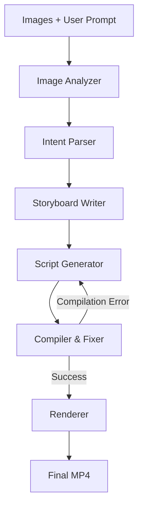

# fotoowl-ai-video-pipeline

# 🎬 FotoOwl AI Video Pipeline

An end-to-end **multi-agent AI system** that converts a folder of images and a natural language prompt into a fully rendered cinematic video using **LangGraph + LLM agents + Remotion**.

---

## 🚀 Overview

This project simulates a production-grade AI video generation system similar to FotoOwl’s core engine.

It takes:

- A folder of raw images
- A user prompt (creative brief)

And generates:

- A structured storyboard
- A Remotion video script
- A compiled and rendered MP4 video

---

## 🧠 System Architecture

The pipeline is built using **LangGraph** and consists of 5 core agents:

```text
Images + Prompt
      ↓
[1] Image Analyzer (vision understanding)
      ↓
[2] Intent Parser (VideoIntent structure)
      ↓
[3] Storyboard Writer (RAG-enhanced planning)
      ↓
[4] Script Generator (Remotion code generation)
      ↓
[5] Compiler & Fixer (error recovery loop)
      ↓
[6] Renderer (Remotion → MP4)
```

# 🤖 Agents Description

## 1. Image Analyzer

- Analyses event images using vision models / heuristics
- Tags images (faces, emotions, scenes)
- Selects best subset of images for storytelling

---

## 2. Intent Parser

Converts raw prompt into structured intent:

```json
{
  "pacing": "slow",
  "visual_style": "cinematic",
  "caption_tone": "emotional",
  "transition_style": "fade"
}
```

## 3. Storyboard Writer (RAG powered)

- Uses style guides + Remotion documentation
- Builds a structured narrative timeline for the video using retrieved context

```json
[
  {
    "image": "img1.jpg",
    "duration": 90,
    "caption": "A beautiful beginning",
    "transition": "fade"
  }
]
```

## 4. Script Generator

- Converts storyboard into valid Remotion React code
- Generates a dynamic composition file
- Maps images, captions, duration, and transitions into Remotion components
- Ensures an executable video rendering script

---

## 5. Compiler & Fixer

- Detects runtime and compilation errors in generated code
- Sends error logs back to the LLM for correction
- Fixes issues iteratively based on feedback
- Retries generation with a controlled number of attempts

## 6. Renderer

- Uses Remotion CLI to render the final video
- Executes the compiled Remotion composition
- Converts the React-based video script into a playable MP4 file
- Outputs the final video as the end result of the pipeline

  ## LangGraph Workflow


# 🧠 Model Selection Rationale

| Agent | Model | Reason |
|--------|-------|--------|
| Image Analyzer | Gemini Vision | Accurate image understanding and scene analysis |
| Intent Parser | Gemini Flash | Fast and cost-effective structured parsing |
| Storyboard Writer | Gemini Pro | Better reasoning for narrative generation |
| Script Generator | Gemini Pro | Produces reliable structured TypeScript/React code |
| Compiler & Fixer | Gemini Pro | Strong debugging and code correction capabilities |

# 📚 RAG Design

The pipeline uses a local ChromaDB vector database containing two collections:

### Style Guides
- Cinematic
- Wedding
- Corporate
- Birthday
- Minimal
- Energetic

These documents help the Storyboard Writer generate videos matching the user's creative intent.

### Remotion Documentation
Contains Remotion API examples including:
- Composition
- Sequence
- AbsoluteFill
- Img
- interpolate
- useCurrentFrame

These snippets are retrieved by the Script Generator and Compiler & Fixer to generate valid Remotion code.

### Chunking Strategy

- Style guides are stored as individual semantic documents.
- Remotion documentation is chunked by API component and example.
- Similarity search retrieves only the most relevant chunks for each agent.

# 🧰 Tech Stack

- Python 3.11+
- LangGraph (multi-agent orchestration)
- OpenAI / Gemini / LLM APIs
- ChromaDB (RAG vector database)
- TypeScript + React (Remotion)
- Node.js (video rendering engine)

---

# 📁 Project Structure

```text
fotoowl-ai-video-pipeline/

├── src/
│   ├── agents/
│   ├── graph.py
│   ├── state.py
│   ├── schemas.py
│
├── rag/
│   ├── style_guides/
│   ├── remotion_docs/
│
├── remotion-video/
│   ├── src/
│   ├── public/images/
│
├── sample_output/
│   ├── graph.mmd
│   ├── storyboard.json
│   ├── FotoOwlReel.mp4
│
├── main.py
├── requirements.txt
└── README.md
```

# ⚙️ Installation

```bash
git clone https://github.com/your-username/fotoowl-ai-video-pipeline.git
cd fotoowl-ai-video-pipeline

python -m venv venv
venv\Scripts\activate   # Windows

pip install -r requirements.txt

cd remotion-video
npm install
```

# ▶️ How to Run

```bash
python main.py --images images --prompt "Cinematic wedding reel, slow and emotional"
```

# 🎥 Output

After successful execution:

```text
sample_output/
 ├── graph.mmd
 ├── storyboard.json
 ├── FotoOwlReel.mp4
```

# 🧪 Testing

The project includes a comprehensive test suite that validates the core functionality of the multi-agent pipeline. Tests use mocked LLM responses where applicable, allowing them to run without requiring live API keys.

Run the test suite with:

```bash
pytest tests/
```

### Test Coverage

- **Graph Flow Tests** – Validate LangGraph workflow execution and state transitions.
- **Intent Parsing Tests** – Verify conversion of user prompts into structured `VideoIntent` objects.
- **RAG Retrieval Tests** – Ensure relevant style guides and Remotion documentation are retrieved correctly.
- **Storyboard Intent Tests** – Confirm that generated storyboards reflect the user's creative intent.
- **Retry Loop Routing Tests** – Validate conditional routing between the Compiler & Fixer and Script Generator nodes.
- **LLM-as-Judge Tests** – Evaluate the narrative coherence and quality of generated storyboards.
- **Mocked LLM Responses** – Enable deterministic and API-independent testing using mock implementations.

# 🧠 Key Features

- Multi-agent LangGraph orchestration for structured AI workflow
- Structured LLM outputs (no free-text parsing, fully schema-driven)
- RAG-enhanced storyboard generation using style guides and Remotion docs
- Self-healing compiler loop with automated error detection and retry mechanism
- Automatic Remotion video rendering from generated React composition
- Modular and scalable AI pipeline architecture designed for real-world use cases

# 📌 Known Limitations

- Requires stable LLM API access for full pipeline execution
- Rendering time depends on number and size of input images
- Limited retry attempts in compiler & fixer loop for error recovery
- No user interface (CLI-based system only)
- Performance may vary depending on model latency and API quotas

# 🔮 Future Improvements

- Web-based UI for real-time preview and video editing
- Smarter image selection model using advanced vision scoring
- Music and audio synchronization for cinematic enhancement
- Faster rendering pipeline optimization for large image sets
- Cloud-based batch processing for scalable video generation

# 👤 Author

Built as part of an AI Engineering multi-agent video generation system inspired by FotoOwl production pipelines.

> > > > > > > e54df536bf652a208e5d03bbba59dcdd293fb6f7
