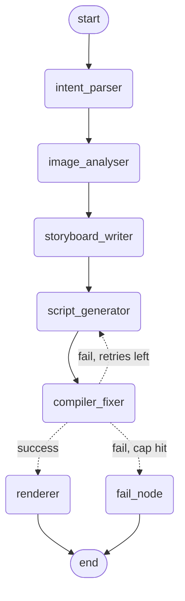

# FotoOwl Image-to-Video Multiagent Pipeline

A LangGraph-orchestrated, five-agent pipeline that turns a folder of event
photos + a free-text style prompt into a rendered Remotion video.

## 1. Setup

```bash
git clone <this repo>
cd fotoowl-pipeline
python -m venv .venv && source .venv/bin/activate
pip install -r requirements.txt

cd remotion && npm install && cd ..   # requires Node.js 18+

cp .env.example .env   # add your GEMINI_API_KEY (get one at https://aistudio.google.com/app/apikey)
```

**Node.js is required** for the Compiler & Fixer (`tsc --noEmit`) and Renderer
(`remotion render`) steps — see `remotion/package.json`. The Python side has
no Node dependency until those two nodes run.

Put 8–12 event photos in `images/` (from the provided Drive folder).

## 2. Run

```bash
python main.py --images images/ --prompt "Cinematic wedding reel, slow and emotional, warm tones, minimal text"
```

Output:
- `sample_output/pipeline_state.json` — the full final state (for review without re-running)
- `sample_output/graph.mmd` — Mermaid source for the graph diagram (regenerated each run)
- the rendered MP4, if compilation succeeded

Run the test suite (no API key needed — everything is mocked):

```bash
pytest tests/ -v
```

## 3. Graph architecture



*(This is the actual diagram exported from the compiled graph via
`app.get_graph().draw_mermaid()` in `src/graph.py::export_graph_mermaid` —
not hand-drawn, so it can't drift from the real wiring. Raw source in
`sample_output/graph.mmd`.)*

**Why the retry loop is `compiler_fixer <-> script_generator`, not a self-loop
on `compiler_fixer`:** the thing that needs to change on failure is the
*script*, and `script_generator` is the node that knows how to retrieve
targeted Remotion API context for the specific error type and rewrite just
the broken part. `compiler_fixer`'s only job is to compile and classify
errors into structured `CompileError` objects — it never authors code. This
keeps each node single-responsibility and makes the retry loop debuggable:
you can inspect `compile_result.errors` at each hop in `node_trace`.

**Hard cap:** `route_after_compile()` in `src/graph.py` checks
`fix_attempts >= max_fix_attempts` (default 3) and routes to `fail_node`,
which emits a structured `PipelineFailure` (failed node, last errors,
attempts made, a suggestion) instead of raising. See
`sample_output/pipeline_state_failure_example.json` for what that looks like.

**Shared state:** `src/state.py::PipelineState` is a flat `TypedDict` —
every node reads keys it needs and returns only the keys it changed;
LangGraph merges them. Flat (not nested) so partial updates are unambiguous.

## 4. Prompt → Intent parsing

`src/intent_parser.py` runs first and is the *only* node that reads the raw
prompt string. It emits a `VideoIntent` (pacing, visual_style, caption_tone,
transition_preference, target_duration_seconds, music_mood) via a forced
tool-call (`structured_call`), never free text. Every other node receives
`intent` from `PipelineState` and never touches `user_prompt` again — this
is enforced structurally (the other agent functions don't even take a
prompt argument), not just by convention.

Two prompts on the same 8 images produce visibly different results — compare:
- `sample_output/storyboard_cinematic.json` vs `sample_output/storyboard_upbeat.json`
- `sample_output/remotion_script_cinematic.tsx` vs `sample_output/remotion_script_upbeat.tsx`

Cinematic: slower per-scene duration, crossfades, understated captions, fewer
scenes selected. Upbeat: faster cuts, hard cuts, punchy captions, more scenes
to keep momentum. (These sample files are generated from the mock fixtures
in `tests/mocks.py` to ship with the repo without spending API credits —
`main.py` produces the same shape from real model calls.)

## 5. RAG design

Two **separate Chroma collections** (`src/rag/vectorstore.py`), not one
collection with a metadata filter — style prose and Remotion code have
different embedding geometry, and mixing them makes the ANN search compete
against irrelevant vectors even with a filter applied.

- **`style_guides`** (`src/rag/seed_data/style_guides.py`): chunked **one
  chunk per (style, facet)** pair — e.g. `cinematic × pacing`,
  `cinematic × captions`, `cinematic × transitions`. A single monolithic
  "cinematic" doc would force retrieval to return one giant blob even when
  only transition guidance is needed. Storyboard Writer queries this with a
  query string built from the `VideoIntent` fields (not the raw prompt).

- **`remotion_snippets`** (`src/rag/seed_data/remotion_snippets.py`): chunked
  **one chunk per component/function**, always a complete, self-contained,
  compilable snippet. Code must never be chunked mid-block — a truncated
  JSX fragment teaches the model broken syntax, which is worse than no
  context at all. Each snippet is tagged with the `error_types` it's
  relevant to fixing. Script Generator retrieves by intent (transitions +
  captions needed); Compiler & Fixer retrieves by the specific
  `CompileError.error_type` on retry, so a `missing_import` error pulls the
  import-reference snippet, not a generic Remotion overview.

**Known limitation:** the fix-context retrieval biases the query text with
the error type token rather than using a Chroma metadata `where` filter,
because Chroma's default filtering doesn't reliably do substring matching
on the comma-joined `error_types` field across versions. With more time I'd
either store `error_types` as a first-class multi-value field (if the
Chroma version in use supports `$in`) or split snippets into per-error-type
sub-collections.

## 6. Multi-model routing

See `src/models/router.py` for the full table and rationale; summary:

| Node | Model | Why |
|---|---|---|
| Intent Parser | gemini-2.5-flash | Tiny structured-extraction task, single call |
| Image Analyser | gemini-2.5-pro (vision) | Only place quality genuinely matters; single call per run |
| Storyboard Writer | gemini-2.5-pro | Creative sequencing benefits from a stronger model |
| Script Generator | gemini-2.5-pro | Code quality determines whether the compile loop even has a chance |
| Compiler Fixer (attempt 1) | gemini-2.5-flash | Most compile errors are mechanical (typo, missing import) |
| Compiler Fixer (attempt 2+) | gemini-2.5-pro | Escalate on evidence — repeated failure suggests a structural issue, not a typo |

**Migration note:** this project originally used the Anthropic API
(claude-haiku-4-5 / claude-sonnet-5). It has since been migrated to Google's
Gemini API (`google-genai` SDK). Only `src/models/client.py` (the LLM
transport layer) and the model identifiers in `src/models/router.py`
changed — the routing *policy* (cheap-by-default, escalate on retry
failure), the LangGraph structure, every agent's logic, and all Pydantic
schemas are unchanged. See `src/models/client.py` for how structured
JSON output and image input are implemented against Gemini.

Cost/quality logic: cheap by default, escalate on evidence of difficulty
rather than paying premium-model cost for every retry iteration up front.
All calls go through `structured_call()` (`src/models/client.py`), which
forces tool-use with a Pydantic schema — no node ever regex-parses a
free-text response.

## 7. Evaluation

`tests/` — runnable with `pytest tests/ -v`, **no API key required**
(everything mocks `src.models.client.structured_call`, the single choke
point every agent uses to talk to a model, per `tests/mocks.py`).

- `test_intent_parsing.py` — two prompts yield intents that differ on
  every axis
- `test_storyboard_reflects_intent.py` — subset selection excludes
  low-quality images; pacing/caption tone change scene output
- `test_retry_loop_routing.py` — the conditional edge routes correctly on
  success / fail-under-cap / fail-at-cap, including a defensive overshoot case
- `test_rag_retrieval.py` — style and Remotion collections return distinct,
  relevant context per query (requires one-time local embedding model
  download — see note below)
- `test_llm_judge_storyboard.py` — **LLM-as-judge**: `src/eval/judge.py`
  scores narrative coherence of a storyboard 0–1; test mocks the model call
  but exercises the real judge function against both a coherent and a
  deliberately broken storyboard
- `test_graph_flow.py` — full graph integration: one run that fails
  compilation once then recovers, one that exhausts retries and exits via
  `fail_node` with a structured `PipelineFailure`

**Note on `test_rag_retrieval.py`:** Chroma's default embedding function
downloads a small ONNX model from S3 on first use. In network-restricted
environments (e.g. this development sandbox) that download can fail; on a
normal machine with internet access it downloads once and caches. This
doesn't affect the other 13 tests, which don't touch the vector store.

## 8. What I'd do differently with more time

- Swap Chroma's default embedding function for a pinned local
  sentence-transformers model bundled in the repo, to remove the
  first-run network dependency entirely.
- Add a `visual_qc` node after the Renderer that samples frames from the
  output MP4 and checks them against the `VideoIntent` (e.g. "does this
  look cinematic?") as a genuine bonus-tier addition, not required by the
  brief but a natural next node — intentionally left out to keep this
  submission close to the ~400-line guidance rather than sprawling.
- Proper multi-value metadata filtering for `error_types` instead of the
  query-text bias workaround described in section 5.
- Parallelize `image_analyser` per-image (currently one batched call) if
  the image count grows past ~15–20.

## 8b. Remotion — what's actually been verified (updated after real testing)

- `npm install` in `remotion/`: **confirmed working** — the original version
  pin (`4.0.190`) didn't exist on the registry and was fixed to `4.0.484`
  (the actual latest stable as of this writing). Verify you're on a current
  version yourself before you submit, since Remotion ships frequently.
- `npx tsc --noEmit -p .` on the placeholder `Composition.tsx`: **confirmed
  passing**, zero errors.
- `npx remotion render`: bundling and composition resolution **confirmed
  working** — it got as far as needing to download Chrome Headless Shell,
  which is genuinely required for every Remotion render (it's a real
  browser-based renderer, not a trick). That download was blocked by this
  sandbox's network allowlist, not a code problem. On a normal machine this
  happens once (~150MB) and is cached for all future renders.
- **Not yet verified:** an actual LLM-generated script (as opposed to the
  static placeholder) compiling and rendering successfully. That's the one
  real unknown left, and it's why the retry loop and RAG-backed fix context
  exist — expect the first generated script to need at least one fix pass.

## 9. Project layout

```
src/
  schemas.py          # every structured I/O type (Pydantic)
  state.py             # shared LangGraph state (TypedDict)
  graph.py             # StateGraph wiring + conditional retry edge
  intent_parser.py
  agents/
    image_analyser.py
    storyboard_writer.py
    script_generator.py
    compiler_fixer.py
    renderer.py
  models/
    router.py           # model-per-node table + escalation policy
    client.py            # single LLM choke point (structured_call)
  rag/
    vectorstore.py        # two Chroma collections
    retriever.py           # 3 retrieval functions (style/api/fix)
    seed_data/
  eval/
    judge.py               # LLM-as-judge narrative coherence
remotion/                    # Remotion project (Node/TS)
tests/                        # pytest, fully mocked
sample_output/                  # example artifacts, ships pre-generated
scripts/generate_sample_outputs.py
main.py
```
